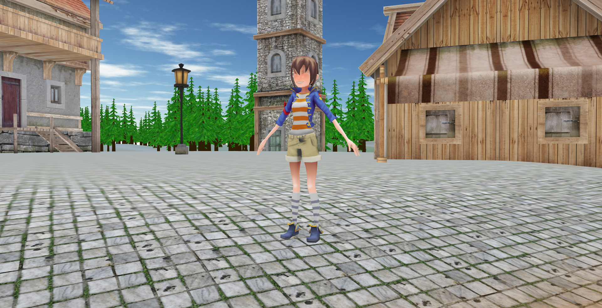

# 3D Engine - RPG Game

My first attempt at a 3D engine using native JavaScript and WebGL.

[](https://victorribeiro.com/3Dengine)

## About

I've made this in order to learn WebGL. If I cannot implement it, I don't understand it, right?! I've created this following the videos from ThinMatrix on YouTube.
[You should check it out](https://www.youtube.com/playlist?list=PLRIWtICgwaX0u7Rf9zkZhLoLuZVfUksDP)

Live version [here](https://victorribeiro.com/3Dengine)

## How to run

The whole thing runs in the browser, but I use *fetch* to load objects, so you'll have to run it on a server.

In PHP you can just CD into the 3Dengine folder and type the bellow command to start a server at http://127.0.0.1:8080 and navigate to that address:

PHP
```bash
php -S 127.0.0.1:8080
```

Python 2
```bash
python -m SimpleHTTPServer 8000
```

Python 3
```bash
python3 -m http.server 8080
```
